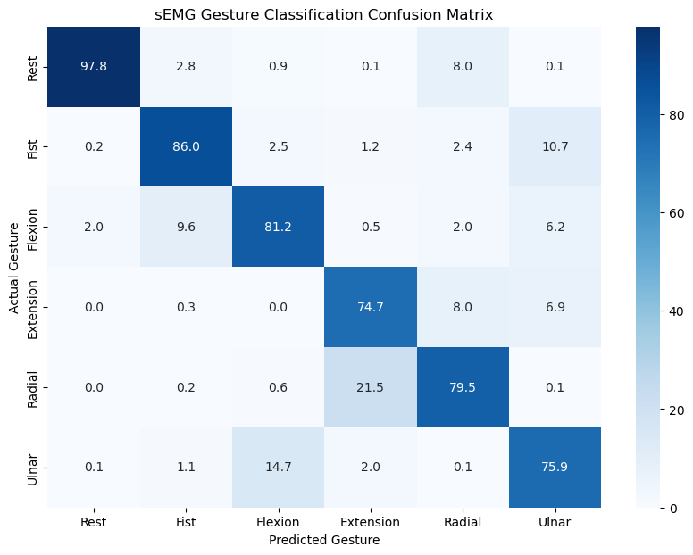

# Model Evaluation Pipeline

This project evaluates a trained deep learning model on EEG/activity recognition data using a standardized test pipeline.

---

## Prerequisites

- Python 3.8+

---

## Step 0: Install Dependencies

Install all required packages using the provided `requirements.txt`:

```bash
pip install -r requirements.txt
```

---

## Step 1: Copy Your Trained Model

Your trained model file must be manually copied into the `models/` directory of this project.

### Requirements

- Your model **must** have been trained on **subjects 1 through 28**.
- The model file must be saved as a PyTorch state dict (`.pt` file).
- The filename **must exactly match** your model's class name.

### Instructions

1. Locate your saved `.pt` model file from your training environment.
2. Copy it into the `models/` directory:

```
project-root/
└── models/
    └── YourModelClassName.pt   ← place your file here
```

3. Ensure the filename matches your model class name exactly. For example, if your model class is `CNN_FANet`, the file must be named `CNN_FANet.pt`.

> ⚠️ **Important:** If the filename does not match the class name exactly (including capitalization), the pipeline will fail to load the model.

---

## Step 2: Copy Your Model Class into `modelClasses.py`

Your model architecture class must be defined inside `modelClasses.py`. Copy your model class definition into that file before running the evaluation.

---

## Step 3: Configure Variables in `main.py`

Open `main.py` and fill in the four variables in the `IMPORTANT` block near the top of the file:

```python
#!!!!!!!!!!!!!!!!!!!!!!!!!!!!!!!!!! IMPORTANT !!!!!!!!!!!!!!!!!!!!!!!!!!!!!!!!!!
# PLEASE DEFINE ALL VARIABLES BELOW ACCORDING TO YOUR MODEL
# Window size used in YOUR TRAINING
window_size = 256
# Stride length used in YOUR TRAINING
stride = 64
# Window type used in YOUR TRAINING, can ONLY be pure or majority
window_type = 'pure'
# MUST be copied into modelClasses.py file
model = modelClasses.CNN_FANet()
#!!!!!!!!!!!!!!!!!!!!!!!!!!!!!!!!!! IMPORTANT !!!!!!!!!!!!!!!!!!!!!!!!!!!!!!!!!!
```

### Variable Descriptions

| Variable | Description | Example Values |
|---|---|---|
| `window_size` | The window size used **during your training** | `256`, `512` |
| `stride` | The stride length used **during your training** | `64`, `128` |
| `window_type` | The windowing method used **during your training** | `'pure'` or `'majority'` |
| `model` | An instance of your model class (defined in `modelClasses.py`) | `modelClasses.CNN_FANet()` |

> ⚠️ **These values must match exactly what was used during training.** Mismatched values will cause the pipeline to load the wrong test loader, producing incorrect evaluation results.

---

## Step 4: Run the Evaluation

Once the model file is in place and `main.py` is configured, run:

```bash
python main.py
```

The pipeline will:
- Load your trained model weights from `models/`
- Load the appropriate test data loader from `data/testLoaders/`
- Run evaluation and log results to TensorBoard under `logs/master/`
- Print a **classification report** to the terminal
- Write a **confusion matrix** and **Matthews Correlation Coefficient (MCC)** to TensorBoard

---

## Project Structure

```
project-root/
├── main.py                  ← configure variables here
├── modelClasses.py          ← copy your model class here
├── eval.py                  ← evaluation logic (do not modify)
├── models/
│   └── YourModelName.pt   ← copy your trained model here
├── data/
│   └── testLoaders/         ← pre-built test loaders (do not modify)
└── logs/
    └── master/              ← TensorBoard logs output here
```

---

## Outputs
- TensorBoard logs: train/test loss per epoch, confusion matrix, MCC score
- Launch TensorBoard: `tensorboard --logdir=logs/`

## Metric
- **Matthews Correlation Coefficient (MCC)** is used over accuracy to account for class imbalance. 
    - Range: -1 to 1
        - 1.0 is perfect classification.
- **Confusion Matrix (CM)** is used to view fine grained misclassifications between gestures.
    - 7x7 matrix
        - 100.0 across diagonal is perfect classification

### Example Confusion Matrix


---

## Viewing Results in TensorBoard

After running the evaluation, launch TensorBoard to view the confusion matrix and MCC:

```bash
tensorboard --logdir logs/master
```

Then open your browser to `http://localhost:6006`.